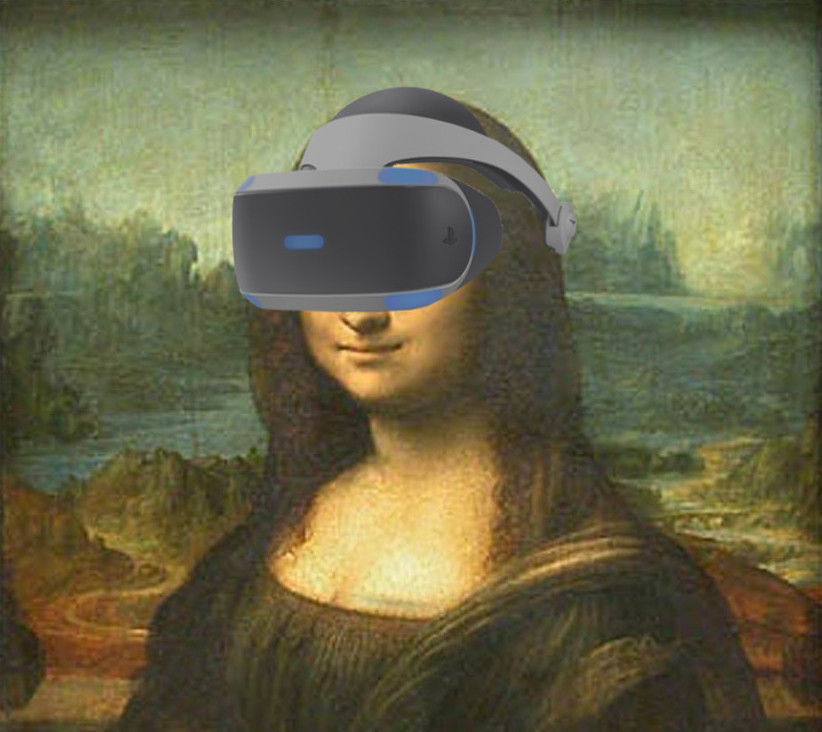

# beautiful-infringements

Explosions of colour rip through the night sky, emanating from a single source and branching like lightning during a sultry summer storm. The bright flashes lighting up the sky like a...speed camera?

As a rule, art is the use of technical ability and imagination to express the beauty and emotional power of subjects, that invoke a powerful reaction in the heart of the beholder. Whereas, speed cameras are the use of technology to test the speeds of Canberran’s and invokes a powerful reaction to the hip pocket of careless drivers.

Our mission is to create something that could be considered beautiful from data that is linked to a subject that is perceived to be so ugly and emotionally charged.

Like the sight spring blossoms of Floriade, like the sunset over the Brindabella’s. Behold the Beautiful Infringements of Canberra. 

We don’t *claim* to be renaissance artists, but, how hard could it be?
